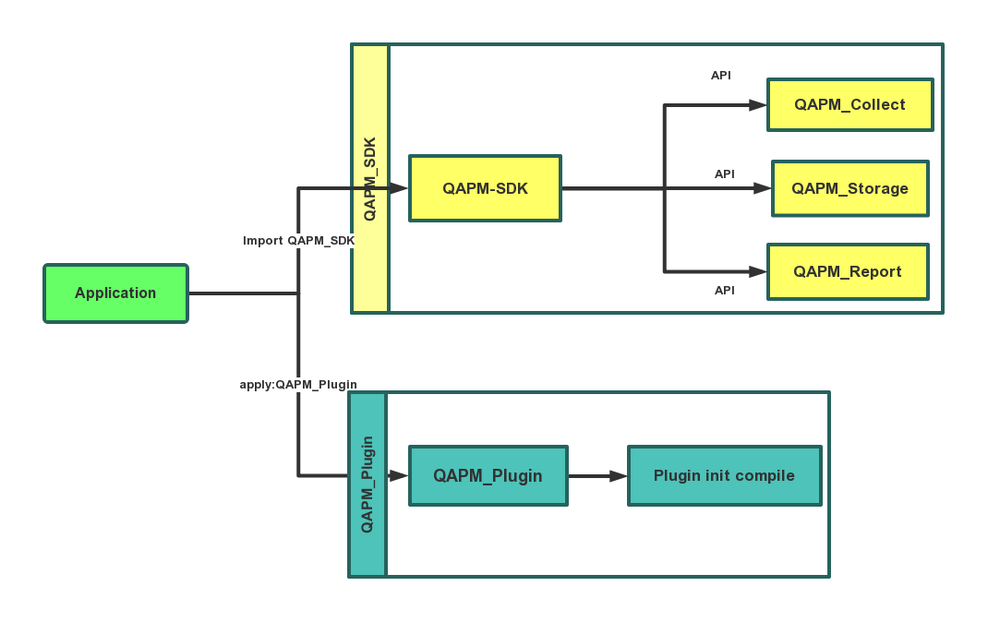

## Qunar-Apm (QAPM)

### 一、背景

QAPM 是去哪儿内部使用的APP监控系统，自2016年诞生以来在去哪儿网所有业务场景当中广泛使用，其中包括报价搜索，酒店搜索等高吞吐量的场景。

### 二、特性

 - 网络请求时长监控
 - 网络数据流量监控
 - 网络请求状态监控及分析
 - 帧率检测监控
 - 内存占用监控
 - CPU使用率监控
 - 电池电量监控

本系统适用于所有类型的应用程序，可以通过QAPM检测应用的各项网络指标，有利于优化应用的网络性能，检测应用的帧率指标，有利于优化应用的UE交互，检测内存占用指标、CPU指标，有利于优化应用运行速度，检测电池相关监控，有利于优化手机的耗电量。

### 三、价值

- 实时监控应用性能
- 提高应用的用户体验
- 降低网络、性能、电量问题的定位成本

### 四、架构

项目整体架构主要分为两部分，如下所示 ：

- library（QAPM）：主要进行性能采集，以及数据存储，与数据上传功能
- Plugin（QAPM-Plugin）：主要进行 AOP 编程，方便性能采集（在编译期间注入一些方便采集数据的代码）

具体架构图如下所示：



- 1、library（QAPM）：该模块主要分为四个Module，主要功能如下所示：

	| Module名称|主要功能|
	|:----|:----|
	| QAPM-main| 监控系统的主要核心业务逻辑|
	| QAPM-Collect| 监控系统的数据收集模块，主要分为以下5中类型数据的分析|
	| | 1、网络相关数据收集|
	| | 2、帧率相关数据收集|
	| | 3、内存相关数据收集|
	| | 4、CPU相关数据收集|
	| | 5、电量相关数据收集|
	| QAPM-Storage|监控系统数据存储主要模块|
	| QAPM-Report|监控系统数据上传主要模块 |

- 2、Plugin（QAPM-Plugin）

	主要在编译期间注入代码，可以更加方便的收集监控数据，无需修改原有工程结构，无侵入接入，使得接入本项目成本降低。

### 五、快速接入

 - 1、项目 Gradle 配置更改

	1.1、在 Project 级别的 build.gradle 文件当中添加 QAPM-Plugin 的相关配置，如下所示

	```gradle
	buildscript {
	    repositories {
	        jcenter()
	    }

	    dependencies {
	        classpath 'com.android.tools.build:gradle:2.2.3'
	        // 此处引入 QAPM-Plugin 的相关配置
	        classpath 'com.qunar.qapm:qapm-plugin:1.0.0'
	    }
	}

	allprojects {
	    repositories {
	        jcenter()
	    }
	}
	```
	1.2、在 app 级别的 build.gradle 文件当中添加插件引用，如下所示

	```gradle
	apply plugin: 'qapm-plugin'

	qExtension {
        configQNecro {
            hookQNecro = true
        }
    }
	```
 - 2、权限相关配置

 	在项目的 AndroidManifest.xml 文件当中声明如下权限

 	```xml
 	<!--需要申请如下权限-->
    <uses-permission android:name="android.permission.INTERNET" />
    <uses-permission android:name="android.permission.CHANGE_WIFI_STATE" />
    <uses-permission android:name="android.permission.ACCESS_WIFI_STATE" />
    <uses-permission android:name="android.permission.BATTERY_STATS" />
    <uses-permission android:name="android.permission.ACCESS_NETWORK_STATE" />
    <uses-permission android:name="android.permission.READ_EXTERNAL_STORAGE" />
    <uses-permission android:name="android.permission.WRITE_EXTERNAL_STORAGE" />
    <uses-permission android:name="android.permission.ACCESS_COARSE_LOCATION" />
    <uses-permission android:name="android.permission.ACCESS_FINE_LOCATION" />
 	```
 - 3、SDK 初始化

 自定义 Application 并且在 Application 的 onCreate() 方法当中初始化 QAPM_SDK ，如下所示：

```java

 //创建配置
Config.ConfigBuilder builder = new Config.ConfigBuilder();

builder.setPid("10001")
.setCid("C1234")
.setVid("1.0.0")
.setLogEnable(true)
.setHostUrl("http://test.host.com/path")
.setSender(null);

//初始化
QAPM.make(getApplicationContext(), builder.build());

//设置自定义数据
QAPM.getInstance().addCustomMonitor(new BaseAPMData() {
		@Override
		public JSONObject toJSONObject() {
			return null;
		}
});

```
| 参数|含义|
|:----|:----|
|pid |产品号，假设公司有多个APP，用此区分|
|cid |渠道标识，不同的渠道下发|
|vid |版本号，程序版本号，一般内部使用|
|uid |设备号，唯一区分一台设备，比如idfa|

 - 4、验证是否接入成功

// 打Log 进行验证，需要一张接入成功的图片

 - 5、混淆文件处理

	无需任何混淆配置，因为 QAPM 的 AAR 自带 Proguard 文件，直接接入 QAPM_SDK 即可生效。

### 六、开放合作

任何企业、个人都可以免费接入本SDK，但是不限于以下几种情况

 - 1、商用项目，去哪儿网提供
 - 2、xxxxx
 - 3、xxxxx
 - 4、xxxxx
 - 5、xxxxx

### 七、更新日志

```
2019.03.20 : 
    更新项目结构，增加gradle plugin 代码到buildSrc目录
    增加okhttp3网络监控，并提供sample
            
```

### 八、反馈与建议

如果在使用的同时发现本项目的错误，请使用如下模版进行反馈

| 类型|描述|
|:----|:----|
|SDK名称|QAPM|
|SDK版本|v2.5.0|
|设备型号|Pixel|
|OS版本|Android 9.0|
|问题描述|描述问题出现的现象|
|操作描述|描述经过如何操作出现上述问题|
|额外附件|文本形式控制台log、crash报告、其他辅助信息（界面截屏或录像等）|

### 九、联系我们
 - 主页 ：[去哪儿旅行](http://www.qunar.com/site/zh/ContactUs_3.shtml)
 - 邮箱 ：[xxxxxx](xxxxxx)
 - Issues : [xxxx](xxxxx)


